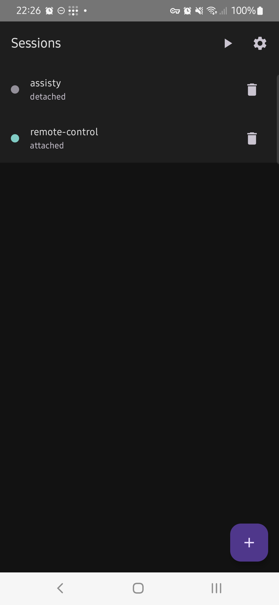
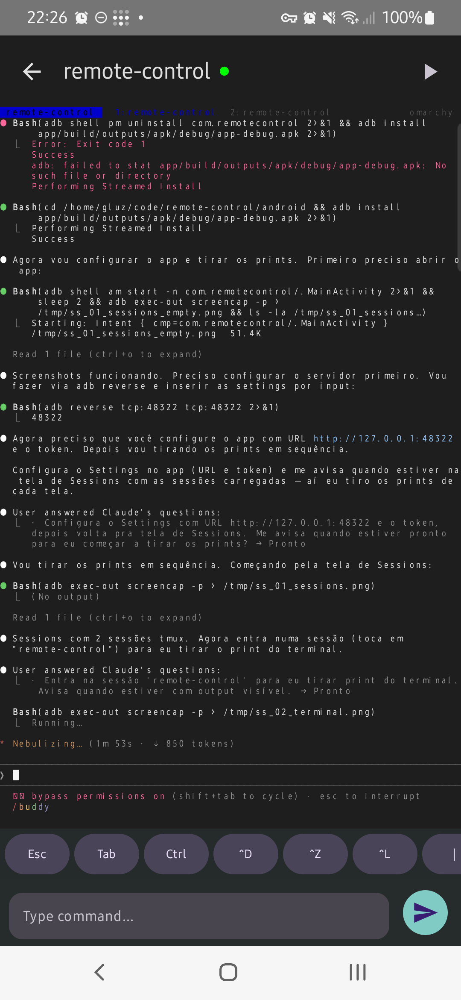
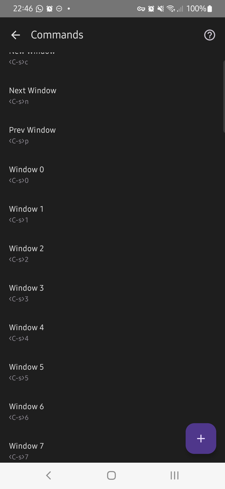
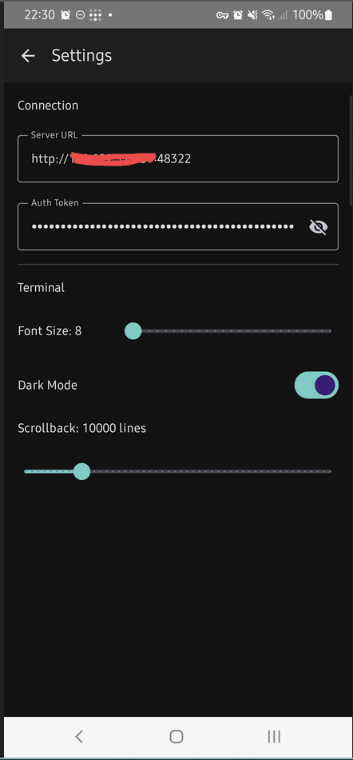

# Remote Control

Control your Linux terminal from your Android phone. Create and manage persistent tmux sessions over WebSocket with real-time ANSI terminal rendering.

## Screenshots

<p align="center">
  
  
  
  
</p>

## Architecture

```
┌──────────────┐     WebSocket / REST      ┌──────────────────┐
│  Android App │  <──────────────────────>  │   Rust Backend   │
│  (Compose)   │    Binary frame protocol   │   (Axum + Tokio) │
└──────────────┘                            └────────┬─────────┘
                                                     │
                                              ┌──────┴──────┐
                                              │  tmux + PTY │
                                              │   (Linux)   │
                                              └─────────────┘
```

## Features

- Real-time bidirectional terminal I/O over WebSocket
- Persistent tmux sessions (survive disconnects and backend restarts)
- Full ANSI/VT100 terminal emulator with 256-color and 24-bit RGB support
- Saved command library with tmux key sequences support (`<C-s>1`, `\xHH`)
- Built-in guide with shell and tmux command examples
- Auto-reconnection with exponential backoff
- Pinch-to-zoom and swipe scroll gestures
- Extra keys bar (Esc, Tab, Ctrl, arrows)
- Token-based authentication with encrypted storage (AES-256-GCM via Android Keystore)
- FLAG_SECURE protection in production builds
- Remote access via Tailscale VPN

## Tech Stack

| Layer | Stack |
|-------|-------|
| Backend | Rust, Axum 0.7, Tokio, SQLite (sqlx), portable-pty |
| Android | Kotlin, Jetpack Compose, Retrofit, OkHttp WebSocket |
| Protocol | Custom binary frames over WebSocket (5 frame types) |
| Auth | Bearer token (256-bit), constant-time comparison, rate limiting |
| Security | AES-256-GCM token encryption, FLAG_SECURE, network security config |

## Prerequisites

- **Backend**: Rust toolchain (1.70+), tmux installed, Linux
- **Android**: Android Studio or JDK 17 + Android SDK 35
- **Device**: Android 8.0+ (API 26)

## Usage Guide

### 1. Start the Backend

```bash
cd backend
cargo build --release
./target/release/remote-control-backend
```

On first run, a token is auto-generated and saved to `config.toml`. The server starts on `0.0.0.0:48322`.

Verify it's running:

```bash
curl http://localhost:48322/health
# ok
```

### 2. Install the Android App

```bash
cd android

# Debug build
./gradlew assembleDebug
adb install -r app/build/outputs/apk/debug/app-debug.apk

# Release build (signed)
./gradlew assembleRelease
adb install -r app/build/outputs/apk/release/app-release.apk
```

### 3. Configure the App

Open the app and go to **Settings** (gear icon):

1. **Server URL**: enter `http://<your-pc-ip>:48322`
2. **Auth Token**: copy the token from `backend/config.toml`

Settings are persisted automatically.

### 4. Connect to a Session

Back on the **Sessions** screen:

- Tap **+** to create a new tmux session
- Tap a session to open the terminal
- The green dot indicates an active (attached) session

### 5. Use the Terminal

Once connected, you have a full interactive terminal:

- **Type commands** in the input field at the bottom and tap Send
- **Extra keys bar**: Esc, Tab, Ctrl, ^D, ^Z, ^L, arrows, pipe, tilde
- **Pinch to zoom** to adjust font size
- **Swipe** to scroll through terminal history

### 6. Saved Commands

Tap the **Play** button in the app bar to access saved commands.

**From Sessions screen** (Play button): opens the full Commands management screen where you can:
- Create commands with the **+** button
- Edit or delete commands via **long-press**
- View the built-in guide with the **?** button

**From Terminal screen** (Play button): opens a quick-select sheet. Tap any command to send it immediately.

#### Tmux Key Sequences

Saved commands support control character syntax for tmux shortcuts:

| Syntax | Meaning | Example |
|--------|---------|---------|
| `<C-s>` | Ctrl+S (tmux prefix) | `<C-s>c` = new window |
| `<C-s>1` | Prefix + 1 | Switch to window 1 |
| `<C-s>n` | Prefix + n | Next window |
| `<C-s>p` | Prefix + p | Previous window |
| `\x13` | Hex escape (0x13 = Ctrl+S) | `\x131` = window 1 |

Commands with control characters are sent without a trailing newline.

### 7. Remote Access (Tailscale)

To access your terminal from anywhere outside your home network:

1. Install [Tailscale](https://tailscale.com/) on your PC and Android device
2. Log in with the same account on both
3. Each device gets a stable `100.x.x.x` IP
4. In the app Settings, set Server URL to `http://<tailscale-ip>:48322`

Tailscale traffic is encrypted via WireGuard, so HTTP is safe over this tunnel.

## Configuration

`backend/config.toml`:

```toml
[server]
host = "0.0.0.0"
port = 48322

[auth]
token = "your-64-char-hex-token"

[terminal]
scrollback_lines = 10000
default_shell = "/bin/bash"
```

## API

All REST endpoints require `Authorization: Bearer <token>`.

| Method | Endpoint | Description |
|--------|----------|-------------|
| GET | `/health` | Health check (no auth) |
| GET | `/sessions` | List tmux sessions |
| POST | `/sessions` | Create new session |
| DELETE | `/sessions/:id` | Kill session |
| GET (WS) | `/sessions/:id/terminal` | WebSocket terminal stream |
| GET | `/commands` | List saved commands |
| POST | `/commands` | Create command |
| PUT | `/commands/:id` | Update command |
| DELETE | `/commands/:id` | Delete command |

### Binary Protocol

WebSocket frames use a 1-byte type prefix:

| Type | Byte | Payload | Direction |
|------|------|---------|-----------|
| Data | `0x00` | Raw terminal bytes | Bidirectional |
| Resize | `0x01` | cols (u16 BE) + rows (u16 BE) | Client > Server |
| Ping | `0x02` | -- | Bidirectional |
| Pong | `0x03` | -- | Bidirectional |
| SessionEvent | `0x04` | JSON `{event_type, session_id}` | Server > Client |

## Testing

```bash
# Backend
cd backend && cargo test

# Android
cd android && ./gradlew test
```

## Project Structure

```
remote-control/
├── backend/
│   ├── src/
│   │   ├── routes/          # REST + WebSocket handlers
│   │   ├── auth.rs          # Token auth + rate limiting
│   │   ├── config.rs        # TOML config loader
│   │   ├── db.rs            # SQLite pool + migrations
│   │   ├── protocol.rs      # Binary frame codec
│   │   └── tmux.rs          # tmux CLI wrapper
│   ├── migrations/          # SQL schema
│   └── config.toml
├── android/
│   └── app/src/main/kotlin/com/remotecontrol/
│       ├── data/            # API clients, models, WebSocket
│       ├── terminal/        # ANSI emulator + Compose renderer
│       ├── ui/
│       │   ├── commands/    # Commands screen, sheet, guide, utils
│       │   ├── sessions/    # Sessions list
│       │   ├── settings/    # App settings
│       │   └── terminal/    # Terminal screen + extra keys
│       └── navigation/      # Compose NavGraph
└── screenshots/
```

## License

Private project. All rights reserved.
